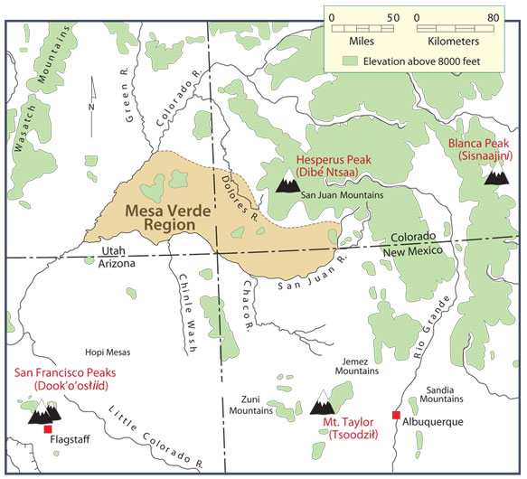

# Backend GIS Challenge
A simple coding challenge for Geospatial backend development using GeoJSON

- https://geojson.org/

## Requirements

Write a backend REST application with a single POST endpoint `/calculate_properties` to calculate Geojson Feature properties and return them to the user.  

- Accept a plain Geojson Feature (Polygon or Multipolygon).
- Return it back to the user with `properties` and `bbox` added, following GeoJSON standards for response format.
- The following `properties` should be included in the response:
  - `area` in sq meters
  - `centroid`
- Python 3.10+ must be used.
- Instructions should be provided for an evaluator to:
  - Run the app locally and exercise the endpoint.
  - Run any automated tests locally.
- Code should be in a git-clonable repo.

## How the challenge will be evaluated
- Code will be subjectively evaluated as per a normal Code Review for quality.
- Simple, valid requests should work locally.
- Automated tests should run locally and pass.
- Do not focus on edge cases or handling invalid inputs.
- Write code that you feel is production-quality in terms of 
  - Cleanliness
  - Organization
  - Automated Testing
  
**Suggested completion time is 1-4 hours.**

## Environment Installation

### Venv and Pip Install

The simplest and likely most popular method for setting up a Python virtual environment is with `Pip`. This avoids overhead with installation and package files that comes with using `Anaconda`, or even `Miniconda` (as documented below). You can execute this code using the basic `pip install` installation method, but first you will need to make sure `Pip` is installed on your machine and recommended to upgrade the pip version:

`python -m pip install --upgrade pip`

Then, you will need to create a virtual environment to install the appropriate libraries so that the backend service will run:

1. Make sure that the virtualenv library is installed:
`pip install virtualenv`

2. Create a new virtual environment called `venv` (this could be named anything):
`virtualenv venv`

3. Activate the virtual environment so that we install Python packages to it and not our base system installation:
`source venv/bin/activate`

Now that the virtual environment is active, you can install the required dependencies one of two ways:

1. Manually install using the `pip install` command for each library:
`pip install fastapi uvicorn geojson-pydantic pytest geopandas`

2. Use the provided `requirements.txt` file which will do the same thing:
`pip install -r requirements.txt`

### Conda Install

**NOTE:** Miniconda is the installlation method I used, as it was already installed on my system, but was tested using `virtualenv` as well.

Assuming someone already has conda (either Anaconda or Miniconda) installed on their local machine, the simplest way to replicate the environment used for this geospatial backend development test is to use the `environment.yml` file provided in the root directory of this repository. The environment can be created with all necessary packages installed by running the following command:

`conda env create -f environment.yml`

**NOTE:** depending on someones system, `environment.yml` files have been known to cause problems, so a similar virtual environment could be configured manually using pip (above) or conda (below). For example, one can first install [Miniconda](https://docs.conda.io/en/latest/miniconda.html) using their installation instructions for either Windows, Mac or Linux machines. Then with conda installed, run these commands to create an environment and install the packages.

1. Create a conda virtual environment:
`conda create -n backend-test`

2. Activate the virtual environment:
`conda activate backend-test`

3. Install required packages:
`conda install -c conda-forge pydantic pytest geopandas fastapi uvicorn geojson-pydantic`

## Application Execution

The application that runs the FastAPI server is located in the `app` folder, driven by the `main.py` script. In the installation setup you installed a package called `uvicorn` which is an ASGI web server implementation to host the API. In a terminal or command line with the virtual environment (above) activated, change the active directory to `app` and execute this line:

`uvicorn main:app --reload`

If everything was successful, then the server process will start in the background, with the API hosted at the localhost address `http://127.0.0.1:8000`. The port number and other server configurations all happen with `uvicorn` so these can be changed. You should see the following output:

```bash
INFO:     Will watch for changes in these directories: ['/{your}/{cloned}/{repo}/backend-gis-challenge/app']
INFO:     Uvicorn running on http://127.0.0.1:8000 (Press CTRL+C to quit)
INFO:     Started reloader process [108764] using StatReload
INFO:     Started server process [108766]
INFO:     Waiting for application startup.
INFO:     Application startup complete.
INFO:     127.0.0.1:47262 - "GET / HTTP/1.1" 200 OK
INFO:     127.0.0.1:47262 - "GET /docs HTTP/1.1" 200 OK
INFO:     127.0.0.1:47262 - "GET /openapi.json HTTP/1.1" 200 OK
```

There are multiple ways to test that this server is working on the local machine. The easiest is to use the FastAPI Documentation automatically generated for the server, but the API can obviously be accessed through other programmatic means, e.g. CURL, Python, JS, etc.

### FastAPI Docs

1. While the server is running, open a web browser and navigate to the following URL:

`http://127.0.0.1:8000/docs`

2. First expand the green panel for the `POST` method `/calculate_properties`. Then find the `Try it out` button located on the right side. This will reveal a text box with which you can enter a GeoJSON request body to test against the API. For example, you could enter the GeoJSON provided below, and then click on `Execute`

```json
{
  "type": "Feature",
  "properties": {},
  "geometry": {
    "coordinates": [
      [
        [
          -112.05258456774443,
          35.01411137365342
        ],
        [
          -104.97678474499669,
          35.01411137365342
        ],
        [
          -104.97678474499669,
          37.835415616424115
        ],
        [
          -112.05258456774443,
          37.835415616424115
        ],
        [
          -112.05258456774443,
          35.01411137365342
        ]
      ]
    ],
    "type": "Polygon"
  }
}
```

3. Scroll down to where you see the response with status code 200, indicating a successful response from the server. The response body with the newly generated properties (`bbox`, `area`, and `centroid`) should look something like the following:

```json
{
  "type": "Feature",
  "geometry": {
    "coordinates": [
      [
        [
          -112.05258456774443,
          35.01411137365342
        ],
        [
          -104.97678474499669,
          35.01411137365342
        ],
        [
          -104.97678474499669,
          37.835415616424115
        ],
        [
          -112.05258456774443,
          37.835415616424115
        ],
        [
          -112.05258456774443,
          35.01411137365342
        ]
      ]
    ],
    "type": "Polygon"
  },
  "properties": {
    "area": {
      "value": 307510138588.7445,
      "unit": "sq meters"
    },
    "centroid": {
      "type": "Point",
      "coordinates": [
        -108.51468465637058,
        36.42476349503877
      ]
    }
  },
  "bbox": [
    -112.05258456774443,
    35.01411137365342,
    -104.97678474499669,
    37.835415616424115
  ]
}
```

The coordinates chosen for the example request and response above are significant because they encapsulate the entire Navajo Nation, and the four sacred mountains within the Navajo (or Diné) tradition, which is a territory of 307,510,138,588 square meters, or 307,510 square kilometers!



[Source: The Four Sacred Mountains of the Navajo (Diné)](https://decolonialatlas.wordpress.com/2015/02/22/the-four-sacred-mountains-of-the-navajo/)

### CURL

Another simple means of testing the server response is to send a request body using a CURL command as shown below:

```bash
curl -X 'POST' \
  'http://127.0.0.1:8000/calculate_properties' \
  -H 'accept: application/json' \
  -H 'Content-Type: application/json' \
  -d '{
  "type": "Feature",
  "properties": {},
  "geometry": {
    "coordinates": [
      [
        [
          -112.05258456774443,
          35.01411137365342
        ],
        [
          -104.97678474499669,
          35.01411137365342
        ],
        [
          -104.97678474499669,
          37.835415616424115
        ],
        [
          -112.05258456774443,
          37.835415616424115
        ],
        [
          -112.05258456774443,
          35.01411137365342
        ]
      ]
    ],
    "type": "Polygon"
  }
}'
```

### Other

Lastly, there are infinite ways to work with an API programatically depending on your programming language of choice. Here I will provide a simple Python script that uses the `requests` library to pass the request body to the server, and the corresponding response body:

```python
import json, requests
from pprint import PrettyPrinter
ppp = PrettyPrinter(indent=2)

api_url = 'http://127.0.0.1:8000/calculate_properties'

request_json = {
  "type": "Feature",
  "properties": {},
  "geometry": {
    "coordinates": [
      [
        [
          -112.05258456774443,
          35.01411137365342
        ],
        [
          -104.97678474499669,
          35.01411137365342
        ],
        [
          -104.97678474499669,
          37.835415616424115
        ],
        [
          -112.05258456774443,
          37.835415616424115
        ],
        [
          -112.05258456774443,
          35.01411137365342
        ]
      ]
    ],
    "type": "Polygon"
  }
}
request_data = json.dumps(request_json)

server_response = requests.post(
    api_url,
    data=request_data,
    headers={"Content-Type": "application/json"}
)

print(server_response.status_code)

ppp.pprint(server_response.json())
```

## Automated Tests


## Future Considerations

* More robust object validation
* Unit tests for more edge cases
* Dynamic handling of CRS inputs/outputs
* Implementation of asynchronous API methods
* Determine other ways to optimize calculations